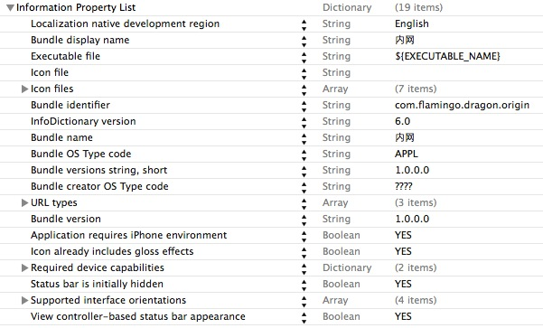

##IOS学习笔记之了解Info.plist文件
####From JiaYing.Cheng

---
---
###元信息简介
为了提供更好的用户体验，IOS 和 OS X的每个app或bundle都依赖于特殊的元信息(meta Information).

元信息有多种用途，包括:

1. 直接向用户展示信息
2. 系统内部用来标识你的app或其支持的文档类型
3. 系统框架用来辅助app的加载

通过一种特殊的信息属性列表文件，app向系统提供自己的元信息。 

属性列表可用来构建任意数据，这些数据在运行时是可访问的。每个属性列表都包含了一个bundle的配置信息。文件中的keys和values描述了许多要应用于该bundle的行为以及配置选项。

**Xcode通常会为每个基于bundle的工程自动创建该属性列表文件，并且提供许多合适的keys以及其对应的默认的values**。之后可以编辑该文件，添加任何工程所需的keys和values，或修改现有的keys所对应的values。 

###Info.plist文件 
每个application都使用Info.plist文件来存储以上的元信息，从名称上也可以判断出Info.plist就是以上提到的“属性列表”。IOS用Info.plist来决定bundle所显示的icon，当前app支持打开的文档类型，等等其它的信息。

正如以上所提到的，Info.plist本身是一种结构化的文本文件，它包含了一些重要的配置信息。Info.plist文件多数情况下是以UTF-8进行编码，并且其内部的配置内容其实是以XML格式进行组织。XML的根节点是一个词典（dictionary），包含描述bundle各个方面的keys和values。系统读取该文件，并获取app的配置信息。 

按照约定，属性列表文件的名称就是Info.plist。该文件名称时大小写敏感的,并且首字母必须是大写的"I".在IOS的apps中，当新工程创建完毕后，会自动创建一个名为<project>-Info.plist文件，该文件位于bundle目录(Supporting Files)的顶部,在工程构建时，该文件用以生成Info.plist文件，之后添加至bundle中

###简单描述Key-Value的意义

先来一发图：

####下面是对这里可能出现的字段的解释：
___
Localiztion native development region		
--- CFBundleDevelopmentRegion	 
本地化相关，如果用户所在地没有相应的语言资源，则用这个key的value来作为默认.

Bundle display name --- CFBundleDisplayName  
设置程序安装后显示的名称。应用程序名称限制在10－12个字符，如果超出，将被显示缩写名称。

Executaule file -- CFBundleExecutable  
程序安装包的名称

Icon file --- CFBundleIconFile  
应用程序图标名称,一般为icon.png

Bundle identifier --- CFBundleIdentifier  
该束的唯一标识字符串，该字符串的格式类似com.yourcompany.yourapp，如果使用模拟器跑你的应用，这个字段没有用处，如果你需要把你的应用部署到设备上，你必须生成一个证书，而在生成证书的时候，在apple的网站上需要增加相应的app IDs.这里有一个字段Bundle identifier，如果这个Bundle identifier是一个完整字符串，那么文件中的这个字段必须和后者完全相同，如果app IDs中的字段含有通配符*，那么文件中的字符串必须符合后者的描述。

InfoDictionary version --- CFBundleInfoDictionaryVersion   
Info.plist格式的版本信息

Bundle OS Type code -- CFBundlePackageType  
用来标识束类型的四个字母长的代码

Bundle versions string, short --- CFBundleShortVersionString  
面向用户市场的束的版本字符串

Bundle creator OS Type code --- CFBundleSignature  
用来标识创建者的四个字母长的代码

Bundle version --- CFBundleVersion  
应用程序版本号，每次部署应用程序的一个新版本时，将会增加这个编号，在app store上用的。

Application require iPhone environment -- LSRequiresIPhoneOS  
用于指示程序包是否只能运行在iPhone OS 系统上。Xcode自动加入这个键，并将它的值设置为true。您不应该改变这个键的值。

Main nib file base name -- NSMainNibFile  
这是一个字符串，指定应用程序主nib文件的名称。如果您希望使用其它的nib文件（而不是Xcode为工程创建的缺省文件）作为主nib文件，可以将该nib文件名关联到这个键上。nib文件名不应该包含.nib扩展名。这个字段可以删除，你可以参考我前面的文章，main函数研究。

supported interface orientations -- UISupportedInterfaceOrientations  
程序默认支持的方向。

___

| 关键字	|类型	|是否必须		|摘要 |
| -----| -----| -----| -----|
| CFBundleDevelopmentRegion	|String	|No	|该束的地区。通常对应于作者的母语。 |
| CFBundleDisplayName	|String	|No	|本地化的束名。 |
| CFBundleDocumentTypes	|Array	|No	|一组描述了该束所支持的文档类型的字典。 |
| CFBundleExecutable	|String	|Yes	|该束的可执行文件名。 |
| CFBundleGetInfoHTML	|String	|No	|用来在Finder的Get Info 面板中显示的更丰富内容的字符串。 |
| CFBundleGetInfoString	|String	|No	|用来在Finder的Get Info 面板中显示的字符串。 |
| CFBundleHelpBookFolder	|String	|No	|含有该束帮助文件的文件夹名字。 |
| CFBundleHelpBookName	|String	|No	|当该束的帮助启动时显示的帮助文件的名字。 |
| CFBundleIconFile	|String	|Yes	|图标文件的文件名。 |
| CFBundleIdentifier	|String	|Yes	|该束的唯一标识字符串。该字符串的格式类似java包的命名方式，例如：com.apple.myapp。 |
| CFBundleInfoDictionaryVersion	|String	|Yes	|Info.plist格式的版本信息。 |
| CFBundleName	|String	|Yes	|束的简称。 |
| CFBundlePackageType	|String	|Yes	|用来标识束类型的四个字母长的代码。 |
| CFBundleShortVersionString	|String	|Yes	|面向用户市场的束的版本字符串。 |
| CFBundleSignature	|String	|Yes	|用来标识创建者的四个字母长的代码。 |
| CFBundleURLTypes	|Array	|No	|一组描述了该束所支持的URL协议的字典。 |
| CFBundleVersion	|String	|Yes	|可执行文件的创建号。 |

---
####更多的Key可以到以下链接查询

1. [About Info.plist Keys](http://developer.apple.com/library/ios/#documentation/General/Reference/InfoPlistKeyReference/Introduction/Introduction.html#//apple_ref/doc/uid/TP40009247)
2. [iPhone中的info.plist文件](http://blog.sina.com.cn/s/blog_aef8b527010180tj.html)

