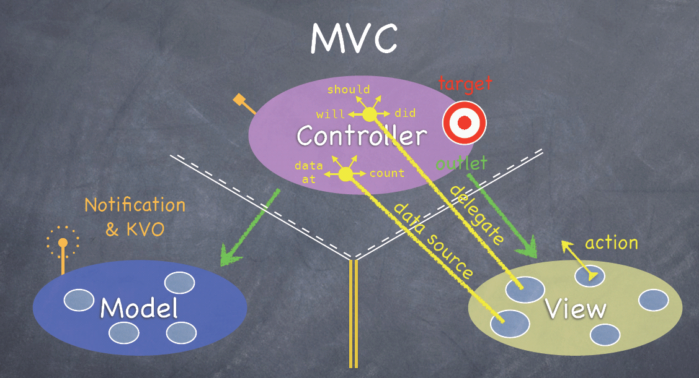

##IOS学习笔记之MVC模式  

---
---

***iOS 开发，以下几种设计模式，是不可不知的：***

- Target Action Design Pattern;

- Notification Pattern

- MVC Pattern

- KVO （Key-Value Observing）

- Singleton Pattern

- Delegate Pattern

###MVC 设计模式

####MVC的概念

MVC是Model-VIew-Controller，就是模型－视图－控制器，这些都是什么东西呢？

MVC把软件系统分为三个部分：Model，View，Controller。在cocoa中，你的程序中的每一个object（对象）都将明显地仅属于这三部分中的一个，而完全不属于另外两个。

Model = 你的程序是什么(而不是你的程序是如何显示的)

Controller = 如何使你的模型呈现给用户(程序逻辑)

View ＝ 在屏幕上你所看到的（是你的Controller的“奴才”）

对于MVC设计模式 并不陌生。从字面意思来理解， Modal , View , Controller ，其用意在于将数据与视图分离开来。  在iOS cocoa touch 编程中， MVC机制被发挥得淋漓尽致。 MVC 示意图如下。 只有充分理解了MVC，才能在编写出优雅的iOS app。为充分理解 MVC， 相关的概念（比如： Delegate、 Protocol、 Notification 等）也要了然于胸。

```
C对M：API
C对V：Outlet
V对C：Target-action， Delegate，Datasource
M对C：Notification，KVO
```
___
MVC 约定， Model 不允许与View 打交道。 Model 是管理数据的， 当Model中的数据发生变化时，与之对应的视图应更新。 这就需要一种机制来支持。为此 iOS 框架提供了两种支持机制： Notification 和KVO （Key-Value Observing）。 KVO 可简单理解为，为你所关注的 Key 对象注册一个监听器。 当有数据发生变化时，就会发出广播给所有的监听器。

MVC 也约定， View 不允许直接引用Modal， 它只能被Controller 所控制。 Controller 控制 View 显示什么数据。我们知道，View 所要显示的数据是来源于 Modal， View 上产生的事件 （ 比如 Touch事件）需要通知 Controller。 既然MVC 不允许直接打交道，就需要提供一种机制。

  不错， iOS 确实提供了一种机制， 名曰： Delegate。 Delegate 这个词， 有人将它译为“委托”，也有人将它译为“代理”。名称上的差异没有什么，重要的是如何理解 Delegate。 Delegate设计模式的引入，就是为了解决UIView与Controller松耦合互动问题。

为便于理解， 这里截取一张iOS MVC示意图：




再详细介绍下这张图的内涵： 

 1. 图中，绿色的箭头表示直接引用。 对View 的直接引用体现在 IBOutlet 上。 当引用一个View 时，比如Button。 需要在ViewController中声明一个  IBOutlet  UIButton * btn；

2. 然后，我们看View 是怎么向 Controller 通信的。对于这个，  iOS 有三种常见的模式：

      设置View对应的Action Target。如设置UIButton的Touch up inside的Action Target。

      设置View的Delegate，如UIAlertViewDelegate, UIActionSheetDelegate，UITextFieldDelegate等。

      设置View的data source, 如UITableViewDataSource。

      通过以上三种模式，View既能向Controller通信，又无需知道具体的Controller是谁，这样，View 就与Controller解耦了。

     除此之外， iOS 还提供了 Action-Target 模式来让Controller 监听View 触发的事件。 View 又是如何获取数据呢？ iOS提供了 Data source 的概念，其实也就是Protocol 的应用。

  综上所述， 正是在iOS MVC框架的驱使下， 才需要深入理解 Delegate、Protocol等概念。
  
  