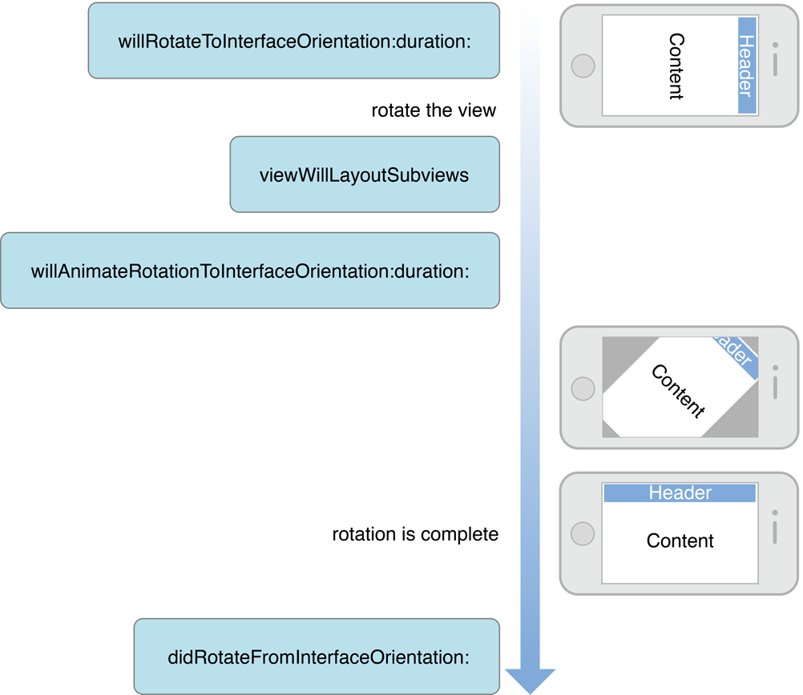
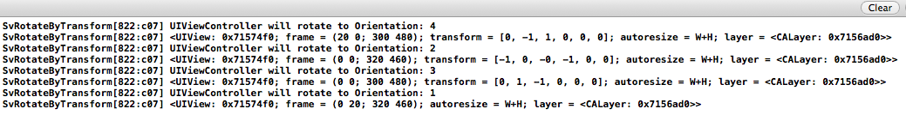
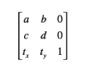
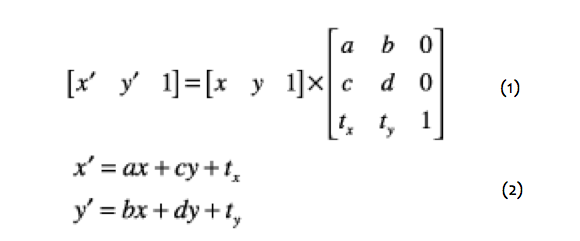
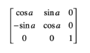

##IOS学习笔记之屏幕旋转与Transform

---
---

加速计是整个IOS屏幕旋转的基础，依赖加速计，设备才可以判断出当前的设备方向，IOS系统共定义了以下七种设备方向：

```
typedef NS_ENUM(NSInteger, UIDeviceOrientation) {
    UIDeviceOrientationUnknown,
    UIDeviceOrientationPortrait,            // Device oriented vertically, home button on the bottom
    UIDeviceOrientationPortraitUpsideDown,  // Device oriented vertically, home button on the top
    UIDeviceOrientationLandscapeLeft,       // Device oriented horizontally, home button on the right
    UIDeviceOrientationLandscapeRight,      // Device oriented horizontally, home button on the left
    UIDeviceOrientationFaceUp,              // Device oriented flat, face up
    UIDeviceOrientationFaceDown             // Device oriented flat, face down
};
```

以及如下四种界面方向：

```
typedef NS_ENUM(NSInteger, UIInterfaceOrientation) {
    UIInterfaceOrientationPortrait           = UIDeviceOrientationPortrait,
    UIInterfaceOrientationPortraitUpsideDown = UIDeviceOrientationPortraitUpsideDown,
    UIInterfaceOrientationLandscapeLeft      = UIDeviceOrientationLandscapeRight,
    UIInterfaceOrientationLandscapeRight     = UIDeviceOrientationLandscapeLeft
};
```

###一、UIKit处理屏幕旋转的流程　

当加速计检测到方向变化的时候，会发出`UIDeviceOrientationDidChangeNotification`通知，这样任何关心方向变化的view都可以通过注册该通知，在设备方向变化的时候做出相应的响应。上一篇博客中，我们已经提到了在屏幕旋转的时候，UIKit帮助我们做了很多事情，方便我们完成屏幕旋转。

UIKit的相应屏幕旋转的流程如下：

1. 设备旋转的时候，UIKit接收到旋转事件。

2. UIKit通过AppDelegate通知当前程序的window。

3. Window会知会它的rootViewController，判断该view controller所支持的旋转方向，完成旋转。

4. 如果存在弹出的view controller的话，系统则会根据弹出的view controller，来判断是否要进行旋转。


###二、UIViewController实现屏幕旋转

　　在响应设备旋转时，我们可以通过UIViewController的方法实现更细粒度的控制，当view controller接收到window传来的方向变化的时候，流程如下：

1. 首先判断当前viewController是否支持旋转到目标方向，如果支持的话进入流程2，否则此次旋转流程直接结束。

2. 调用 willRotateToInterfaceOrientation:duration: 方法，通知view controller将要旋转到目标方向。如果该viewController是一个container view controller的话，它会继续调用其content view controller的该方法。这个时候我们也可以暂时将一些view隐藏掉，等旋转结束以后在现实出来。

3. window调整显示的view controller的bounds，由于view controller的bounds发生变化，将会触发 viewWillLayoutSubviews 方法。这个时候self.interfaceOrientation和statusBarOrientation方向还是原来的方向。

4. 接着当前view controller的 willAnimateRotationToInterfaceOrientation:duration: 方法将会被调用。系统将会把该方法中执行的所有属性变化放到动animation block中。

5. 执行方向旋转的动画。

6. 最后调用 didRotateFromInterfaceOrientation: 方法，通知view controller旋转动画执行完毕。这个时候我们可以将第二部隐藏的view再显示出来。

　　整个响应过程如下图所示：
　　



以上就是UIKit下一个完整的屏幕旋转流程，我们只需要按照提示做出相应的处理就可以完美的支持屏幕旋转。

###三、注意事项和建议

######1）注意事项

　　当我们的view controller隐藏的时候，设备方向也可能发生变化。例如view Controller A弹出一个全屏的view controller B的时候，由于A完全不可见，所以就接收不到屏幕旋转消息。这个时候如果屏幕方向发生变化，再dismiss B的时候，A的方向就会不正确。我们可以通过在view controller A的viewWillAppear中更新方向来修正这个问题。

######2）屏幕旋转时的一些建议

在旋转过程中，暂时界面操作的响应。
旋转前后，尽量当前显示的位置不变。
对于view层级比较复杂的时候，为了提高效率在旋转开始前使用截图替换当前的view层级，旋转结束后再将原view层级替换回来。
在旋转后最好强制reload tableview，保证在方向变化以后，新的row能够充满全屏。例如对于有些照片展示界面，竖屏只显示一列，但是横屏的时候显示列表界面，这个时候一个界面就会显示更多的元素，此时reload内容就是很有必要的。


===

===


　iTouch，iPhone，iPad设置都是支持旋转的，如果我们的程序能够根据不同的方向做出不同的布局，体验会更好。

　　如何设置程序支持旋转呢，通常我们会在程序的info.plist中进行设置Supported interface orientations，添加我们程序要支持的方向，而且程序里面每个viewController也有方法

　　supportedInterfaceOrientations(6.0及以后)

　　shouldAutorotateToInterfaceOrientation(6.0之前的系统)

　　通过viewController的这些方法，我们可以做到更小粒度的旋转控制，如程序中仅仅允许个别界面旋转。

 

###四、屏幕旋转背后到底做了什么呢？

　　下面我们看个简单的例子，用xcode新建一个默认的单视图工程，然后在对应viewController的响应旋转后的函数中输出一下当前view的信息，代码如下：

```
SvRotateViewController

//
//  SvRotateViewController.m
//  SvRotateByTransform
//
//  Created by  maple on 4/21/13.
//  Copyright (c) 2013 maple. All rights reserved.
//

#import "SvRotateViewController.h"

@interface SvRotateViewController ()

@end

@implementation SvRotateViewController

- (void)viewDidLoad
{
    [super viewDidLoad];
    // Do any additional setup after loading the view, typically from a nib.
    
    self.view.backgroundColor = [UIColor grayColor];
}

- (void)didReceiveMemoryWarning
{
    [super didReceiveMemoryWarning];
    // Dispose of any resources that can be recreated.
}

- (BOOL)shouldAutorotateToInterfaceOrientation:(UIInterfaceOrientation)interfaceOrientation
{
    return YES;
}

- (BOOL)shouldAutorotate
{
    return YES;
}

- (NSUInteger)supportedInterfaceOrientations
{
    return UIInterfaceOrientationMaskAll;
}

- (void)willRotateToInterfaceOrientation:(UIInterfaceOrientation)toInterfaceOrientation duration:(NSTimeInterval)duration
{
    NSLog(@"UIViewController will rotate to Orientation: %d", toInterfaceOrientation);
}

- (void)didRotateFromInterfaceOrientation:(UIInterfaceOrientation)fromInterfaceOrientation
{
    NSLog(@"did rotated to new Orientation, view Information %@", self.view);
}

@end
```

查看代码我们可以发现，我们的viewController支持四个方向，然后在旋转完成的didRotateFromInterfaceOrientation函数中打印了self.view的信息，旋转一圈我们可以看到如下输出：



设备的初始方向是UIInterfaceOrientationPortrait的，然后顺时针依次经过LandscapeLeft，PortraitUpsideDown，LandscapeRight，最后再回到UIInterfaceOrientationPortrait方向。仔细看的话我们会发现在旋转的过程中，除了frame之外，Transform也在一直变化。观察frame发现，它的变化应该是由于系统的状态栏引起的。于是将系统状态栏隐藏掉，在输出发现frame果然不再变化。因此我们可以怀疑屏幕旋转是通过变化Transform实现的。

###五、什么是Transform

　　Transform(变化矩阵)是一种3×3的矩阵，如下图所示：



　　通过这个矩阵我们可以对一个坐标系统进行缩放，平移，旋转以及这两者的任意组着操作。而且矩阵的操作不具备交换律，即矩阵的操作的顺序不同会导致不同的结果。UIView有个transform的属性，通过设置该属性，我们可以实现调整该view在其superView中的大小和位置。

　　矩阵实现坐标变化背后的数学知识：



　　设x，y分别代表在原坐标系统中的位置，x'，y'代表通过矩阵变化以后在新的系统中的位置。其中式1就是矩阵变化的公式，对式1进行展开以后就可以得到式2。从式2我们可以清楚的看到（x，y）到（x'，y'）的变化关系。

　　1）当c，b，tx，ty都为零时，x' = ax，y' = by；即a，d就分别代表代表x，y方向上放大的比例；当a，d都为1时，x' = x，y' = y；这个时候这个矩阵也就是传说中的CGAffineTransformIdentity(标准矩阵)。

　　2）当a，d为1，c，b为零的时候，x' = x + tx，y' = y + ty；即tx，ty分别代表x，y方向上的平移距离。

　　3）前面两种情况就可以实现缩放和平移了，那么旋转如何表示呢？

　　假设不做平移和缩放操作，那么从原坐标系中的一点(x，y)旋转α°以后到了新的坐标系中的一点(x'，y')，那么旋转矩阵如下：

　　

　　展开以后就是x' = xcosα - ysinα，y' = xsinα + ycosα；

 

　　实际应用中，我们将这些变化综合起来，即可完成所有二维的矩阵变化。现在我们在回过头来看看前面设备旋转时的输出，当设备位于Portrait的时候由于矩阵是标准矩阵，所以没有进行打印。当转到UIInterfaceOrientationLandscapeLeft方向的时候，我们的设备是顺时针转了90°(逆时针为正，顺时针为负)，这个时候矩阵应该是（cos-90°，sin-90°，-sin-90°，cos-90°，tx，ty），由于未进行平移操作所以tx，ty都为0，刚好可以跟我们控制台输出："<UIView: 0x8075390; frame = (0 0; 320 480); transform = [0, -1, 1, 0, 0, 0]; autoresize = W+H; layer = <CALayer: 0x8074980>>"一致。观察其他两个方向的输出，发现结果均和分析一致。

　　由此可以发现屏幕旋转其实就是通过view的矩阵变化实现，当设备监测到旋转的时候，会通知当前程序，当前程序再通知程序中的window，window会通知它的rootViewController的，rootViewController对其view的transform进行设置，最终完成旋转。

　　如果我们直接将一个view添加到window上，系统将不会帮助我们完成旋操作，这个时候我们就需要自己设置该view的transform来实现旋转了。这种情况虽然比较少，但是也存在的，例如现在很多App做的利用状态栏进行消息提示的功能就是利用自己创建window并且自己设置transform来完成旋转支持的.

___
　　
[http://www.cnblogs.com/smileEvday/archive/2013/04/24/Rotate2.html](http://www.cnblogs.com/smileEvday/archive/2013/04/24/Rotate2.html))