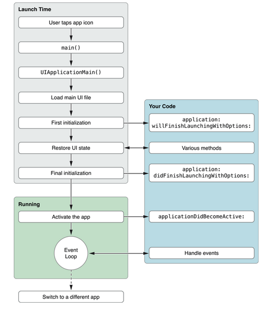
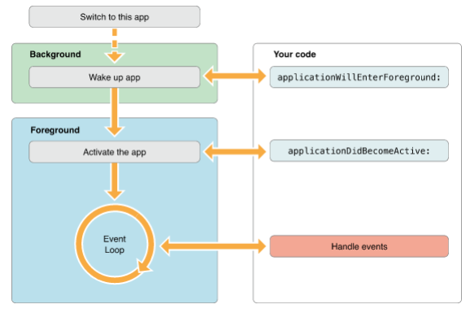

##IOS学习笔记之应用程序生命周期(前后台切换,应用的各种状态)详解

---
---


IOS的应用程序的生命周期，还有程序是运行在前台还是后台，应用程序各个状态的变换，这些对于开发者来说都是很重要的。 iOS系统的资源是有限的，应用程序在前台和在后台的状态是不一样的。在后台时，程序会受到系统的很多限制，这样可以提高电池的使用和用户体验。
//开发app,我们要遵循apple公司的一些指导原则，原则如下：

###1、应用程序的状态
状态如下：

|状态名       | 状态名（译）| 程序状态  |
|----------- | ----- | -------- |
|Not running | 未运行 | 程序没启动 |
|Inactive    | 未激活 | 程序在前台运行，不过没有接收到事件。在没有事件处理情况下程序通常停留在这个状态|
|Active      | 激活  | 程序在前台运行而且接收到了事件。这也是前台的一个正常的模式 |
|Backgroud   |  后台 | 程序在后台而且能执行代码，大多数程序进入这个状态后会在在这个状态上停留一会。时间到之后会进入挂起状态(Suspended)。有的程序经过特殊的请求后可以长期处于Backgroud状态 |
|Suspended   | 挂起  | 程序在后台不能执行代码。系统会自动把程序变成这个状态而且不会发出通知。当挂起时，程序还是停留在内存中的，当系统内存低时，系统就把挂起的程序清除掉，为前台程序提供更多的内存。|

下图是程序状态变化图：


各个程序运行状态时代理的回调：
`- (BOOL)application:(UIApplication *)application willFinishLaunchingWithOptions:(NSDictionary *)launchOptions`
      告诉代理进程启动但还没进入状态保存
`- (BOOL)application:(UIApplication *)application didFinishLaunchingWithOptions:(NSDictionary *)launchOptions`
     告诉代理启动基本完成程序准备开始运行
`- (void)applicationWillResignActive:(UIApplication *)application`
    当应用程序将要入非活动状态执行，在此期间，应用程序不接收消息或事件，比如来电话了
`- (void)applicationDidBecomeActive:(UIApplication *)application `
     当应用程序入活动状态执行，这个刚好跟上面那个方法相反
`- (void)applicationDidEnterBackground:(UIApplication *)application`
    当程序被推送到后台的时候调用。所以要设置后台继续运行，则在这个函数里面设置即可
`- (void)applicationWillEnterForeground:(UIApplication *)application`
	当程序从后台将要重新回到前台时候调用，这个刚好跟上面的那个方法相反。
`- (void)applicationWillTerminate:(UIApplication *)application`
	当程序将要退出是被调用，通常是用来保存数据和一些退出前的清理工作。这个需要要设置UIApplicationExitsOnSuspend的键值。
`- (void)applicationDidFinishLaunching:(UIApplication*)application`
	当程序载入后执行

在上面8个方法对应的方法中键入NSLog打印。
现在启动程序看看执行的顺序： 

启动程序  
lifeCycle[40428:11303] willFinishLaunchingWithOptions  
lifeCycle[40428:11303] didFinishLaunchingWithOptions  
lifeCycle[40428:11303] applicationDidBecomeActive  
按下home键  
lifeCycle[40428:11303] applicationWillResignActive  
lifeCycle[40428:11303] applicationDidEnterBackground  
双击home键，再打开程序  
lifeCycle[40428:11303] applicationWillEnterForeground  
lifeCycle[40428:11303] applicationDidBecomeActive  


###2、应用程序的生命周期
####2.1、加载应用程序进入前台



####2.2、加载应用程序进入后台


####2.3、关于main函数
main函数是程序启动的入口，在iOS app中，main函数的功能被最小化，它的主要工作都交给了UIKit framework

```
 #import <UIKit/UIKit.h>  
   
int main(int argc, char *argv[])  
{  
    @autoreleasepool {  
        return UIApplicationMain(argc, argv, nil, NSStringFromClass([MyAppDelegate class]));  
    }  
}
```

UIApplicationMain函数有四个参数，你不需要改变这些参数值，不过我们也需要理解这些参数和程序是如何开始的
argc 和argv参数包含了系统带过来的启动时间。  第三个参数确定了主要应用程序类的名称，这个参数指定为nil，这样UIKit就会使用默认的程序类UIApplication。第四个参数是程序自定义的代理类名，这个类负责系统和代码之间的交互。它一般在Xcode新建项目时会自动生成。
另外 UIApplicationMain函数加载了程序主界面的文件。虽然这个函数加载了界面文件，但是没有放到应用程序的windows上，你需要在Delegate的 application:willFinishLaunchingWithOptions方法中加载它。
一个应用程序可以有一个主的storyboard文件或者有一个主的nib文件，但不能同时有两个存在。
如果程序在启动时没有自动加载主要的故事版或nib文件，你可以在application:willFinishLaunchingWithOptions方法里准备windows的展示。

###3、响应中断
####3.1 当一个基于警告式的中断发生时，比如有电话打进来了，这是程序会临时进入inactive状态，这用户可以选择如何处理这个中断，流程如下图：


在iOS5,通知不会把程序变成为激活状态，通知会显示在状态栏上，如果你；拉下状态栏，程序会变成inactive,把状态栏放回去，程序变回active。
按锁屏键也是另外一种程序的中断，当你按下锁屏键，系统屏蔽了所有触摸事件，把app放到了后台，这时app状态是 inactive，并进入后台。

####3.2 当有这些中断时，我们的app该怎么办呢？我们应该在applicationWillResignActive:方法中：

- 停止timer 和其他周期性的任务
- 停止任何正在运行的请求
- 暂停视频的播放
- 如果是游戏那就暂停它
- 减少OpenGL ES的帧率
- 挂起任何分发的队列和不重要的操作队列（你可以继续处理网络请求或其他时间敏感的后台任务）。

当程序回到active状态 ，   applicationDidBecomeActive:   方法应该上面提到的任务重新开始，比如重新开始timer, 继续分发队列，提高OpenGL ES的帧率。不过游戏要回到暂停状态，不能自动开始。

###4、转到后台运行
####4.1 如图所示：


PS:只有在IOS4以上系统或者支持多任务的设备才能后台运行。不然会直接结束状态。

####4.2 当应用程序进入后台时，我们应该做写什么呢？

保存用户数据或状态信息，所有没写到磁盘的文件或信息，在进入后台时，最后都写到磁盘去，因为程序可能在后台被杀死，

释放尽可能释放的内存

applicationDidEnterBackgound: 方法有大概5秒的时间让你完成这些任务。如果超过时间还有未完成的任务，你的程序就会被终止而且从内存中清除。如果还需要长时间的运行任务，可以调用  `beginBackgroundTaskWithExpirationHandler`方法去请求后台运行时间和启动线程来运行长时间运行的任务。

####4.3 应用程序在后台时的内存使用
在后台时，每个应用程序都应该释放最大的内存。系统努力的保持更多的应用程序在后台同时 运行。不过当内存不足时，会终止一些挂起的程序来回收内存，那些内存最大的程序首先被终止。
事实上，应用程序应该的对象如果不再使用了，那就应该尽快的去掉强引用，这样编译器可以回收这些内存。如果你想缓存一些对象提升程序的性能，你可以在进入后台时，把这些对象去掉强引用。
下面这样的对象应该尽快的去掉强引用：
图片对象
你可以重新加载的 大的视频或数据文件
任何没用而且可以轻易创建的对象
在后台时，为了减少程序占用的内存，系统会自动在回收一些系统帮助你开辟的内存。比如：
系统回收Core Animation的后备存储。
去掉任何系统引用的缓存图片
去掉系统管理数据缓存强引用

###5 、返回前台运行
流程如图所示：



当app处于挂起状态时，它是不能执行任何代码的。因此它不能处理在挂起期间发过来的通知，比如方向改变，时间改变，设置的改变还有其他影响程序展现的或状态的通知。在程序返回后台或前台是，程序都要正确的处理这些通知。

###6、程序的终止
程序只要符合以下情况之一，只要进入后台或挂起状态就会终止：
iOS4.0以前的系统
app是基于iOS4.0之前系统开发的。
设备不支持多任务
在Info.plist文件中，程序包含了 UIApplicationExitsOnSuspend  键。
app如果终止了  ,系统会调用app的代理的方法 applicationWillTerminate:   这样可以让你可以做一些清理工作。你可以保存一些数据或app的状态。这个方法也有5秒钟的限制。超时后方法会返回程序从内存中清除。
注意：用户可以手工关闭应用程序。

###7、 The Main Run Loop  主运行循环
Main Run Loop负责处理用户相关的事件。UIApplication对象在程序启动时启动main run Loop，它处理事件和更新视图的界面。看Main Run Loop就知道，它是运行在程序的主线程上的。这样保证了接收到用户相关操作的事件是按顺序处理的。

**Main Run Loop  处理事件的架构图：**


用户操作设备，相关的操作事件被系统生成并通过UIKit的指定端口分发。事件在内部排成队列，一个个的分发到Main run loop 去做处理。UIApplication对象是第一个接收到时间的对象，它决定事件如何被处理。触摸事件分发到主窗口，窗口再分发到对应出发触摸事件的View。其他的事件通过其他途径分发给其他对象变量做处理。

大部分的事件可以在你的应用里分发，类似于触摸事件，远程操控事件（线控耳机等）都是由app的 responder objects 对象处理的。Responder objects 在你的app里到处都是，比如：UIApplication 对象。view对象，view controller 对象，都是resopnder objects。大部分事件的目标都指定了resopnder object，不过事件也可以传递给其他对象。比如，如果view对象不处理事件，可以传给父类view或者view controller。

**参考：**

[参考1](http://blog.csdn.net/totogo2010/article/details/8048652)

[参考2](https://developer.apple.com/library/ios/#documentation/iPhone/Conceptual/iPhoneOSProgrammingGuide/ManagingYourApplicationsFlow/ManagingYourApplicationsFlow.html#//apple_ref/doc/uid/TP40007072-CH4-SW20)